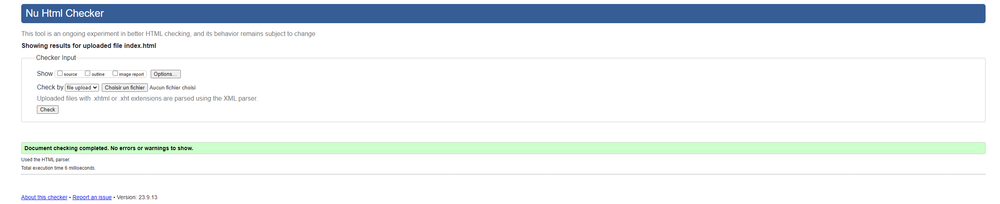
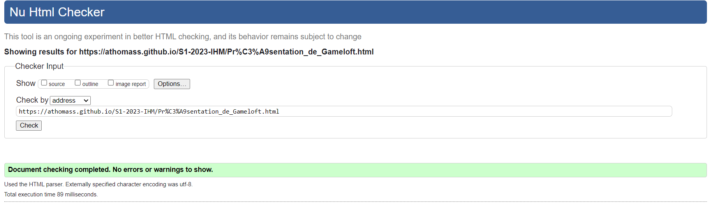

# Projet SAE   

## Sujet   

Gameloft (https://athomass.github.io/S1-2023-IHM/)

## Membres du groupe :

Etudiant 1 (référent du groupe) :  Estrade Hugues(hugues.estrades@edu.univ-fcomte.fr)  
Etudiant 2 : Contois Romain   
Etudiant 3 : Thomasset Annaeg  
Etudiant 4 : Ez-zouak Mehdi  
Etudiant 5 : Ettabaa Younes

# Présentation du projet

Notre projet consiste à présenter l'entreprise Gameloft d'un point de vue économique.

Pour faire ceci, nous allons créer un site web comportant:

- Une page d'accueil (Estrade Hugues)
- Une page d'introduction à Gameloft (Romain Contois)
- Une page pour situer Gameloft dans l'industrie du jeu vidéo (Ez-zouak Mehdi)
- Une page pour illustrer les données économiques de Gameloft en chiffre (Annaeg Thomasset)
- Une page pour présenter la stratégie économique de Gameloft(Ettabaa Younes)

# Développement Site Web et Validation des pages  

### Page d'accueil 

**Auteur : Hugues Estrade** 

Vérification W3C : (https://validator.w3.org/nu/?doc=https%3A%2F%2Fathomass.github.io%2FS1-2023-IHM%2F)

### Présentation de Gameloft 

**Auteur : Contois Romain** 

Vérification W3C : (https://validator.w3.org/nu/?doc=https%3A%2F%2Fathomass.github.io%2FS1-2023-IHM%2FPr%25C3%25A9sentation_de_Gameloft.html)

### Données économiques de Gameloft 

**Auteur : Thomasset Annaeg ** 

Vérification W3C : (https://validator.w3.org/nu/?doc=https%3A%2F%2Fathomass.github.io%2FS1-2023-IHM%2Fpage2.html)

### Gameloft dans l'industrie du jeu vidéo

**Auteur : Ez-zouak Mehdi ** 

Vérification W3C : (https://validator.w3.org/nu/?doc=https%3A%2F%2Fathomass.github.io%2FS1-2023-IHM%2Fpage3.html)

### Stratégie économique de Gameloft

**Auteur : Ettabaa Younes ** 

Vérification W3C : (https://validator.w3.org/nu/?doc=https%3A%2F%2Fathomass.github.io%2FS1-2023-IHM%2Fpage4.html)

